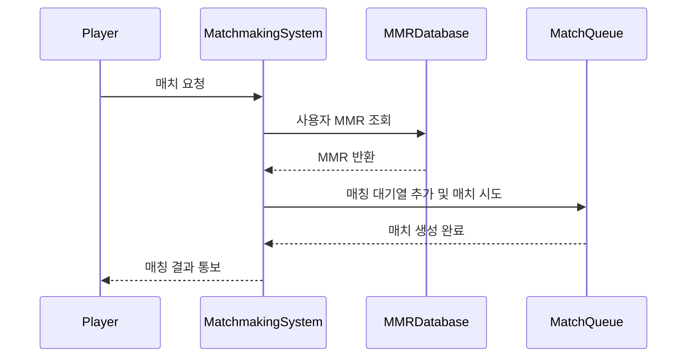

# Matchmaking

본 프로젝트는 플레이어의 MMR 정보를 기반으로 비슷한 실력의 상대를 자동으로 찾아주는 간단한 매칭 시스템입니다.

## ⚙️ 주요 기능

- 플레이어의 MMR 데이터 관리
- 매치 요청 처리
- MMR 조건에 따른 자동 매칭
- 매치 결과 출력

## 📋 ChatGPT의 모듈 평가

### 🧩 응집도

응집도는 **비교적 높게 평가할 수 있습니다.**
    matchmakingSystem, matchmakingRequest 함수는 각각 명확한 역할과 책임을 가지고 있습니다.
    Player, MMRDatabase, matchQueue 등 역할별 데이터 구조가 잘 분리되어 있습니다.
    한 함수가 너무 많은 일을 하지 않으며, 매칭 관련 기능에 집중하고 있어 코드가 깔끔합니다.

### 🔗 결합도

결합도는 **낮은 편이나 일부 결합이 존재합니다.**
    matchmakingSystem 함수가 전역 변수로 선언된 MMRDatabase와 matchQueue에 직접 접근하여여 의존성이 있습니다.
    만약 MMRDatabase나 matchQueue 구조가 변경될 경우 해당 함수들에 영향이 있을 수 있습니다.
    다만 함수 간 호출 관계가 단순하고, 전체적인 의존성은 크게 복잡하지 않은 편입니다.

## 📊 시퀀스 다이어그램

