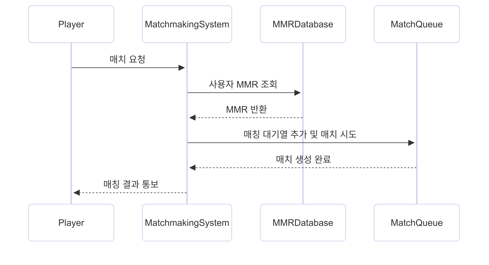

# Matchmaking

본 프로젝트는 플레이어의 MMR 정보를 기반으로 비슷한 실력의 상대를 자동으로 찾아주는 간단한 매칭 시스템입니다.

## ⚙️ 주요 기능

- 플레이어의 MMR 데이터 관리
- 매치 요청 처리
- MMR 조건에 따른 자동 매칭
- 매치 결과 출력

## 📋 ChatGPT의 모듈 평가

### 🧩 응집도

응집도는 **비교적 높게 평가할 수 있습니다.**<br>
`matchmakingSystem`, `matchmakingRequest` 함수는 각각 명확한 역할과 책임을 가지고 있습니다. `Player`, `MMRDatabase`, `matchQueue` 등 역할별 데이터 구조가 잘 분리되어 있습니다. 한 함수가 너무 많은 일을 하지 않으며, 매칭 관련 기능에 집중하고 있어 코드가 깔끔합니다.

### 🔗 결합도

결합도는 **낮은 편이나 일부 결합이 존재합니다.**<br>
`matchmakingSystem` 함수가 전역 변수로 선언된 `MMRDatabase`와 `matchQueue`에 직접 접근하여 의존성이 있습니다. 만약 `MMRDatabase`나 `matchQueue` 구조가 변경될 경우 해당 함수들에 영향이 있을 수 있습니다. 다만 함수 간 호출 관계가 단순하고, 전체적인 의존성은 크게 복잡하지 않은 편입니다.

## 📊 시퀀스 다이어그램

```
sequenceDiagram
    participant Player
    participant MatchmakingSystem
    participant MMRDatabase
    participant MatchQueue

    Player ->> MatchmakingSystem: 매치 요청
    MatchmakingSystem ->> MMRDatabase: 사용자 MMR 조회
    MMRDatabase -->> MatchmakingSystem: MMR 반환
    MatchmakingSystem ->> MatchQueue: 매칭 대기열 추가 및 매치 시도
    MatchQueue -->> MatchmakingSystem: 매치 생성 완료
    MatchmakingSystem -->> Player: 매칭 결과 통보
```



## 🛠️ 개발 중 문제와 해결

일상 속 소프트웨어 사용 사례로 철권 시리즈를 선택했습니다.

원래는 사용자의 ID를 직접 입력받아 매칭 요청을 하도록 개발할 계획이었으나, 입력 과정에서 오타가 잦고 데이터베이스에 있는 ID를 확인하기 어려운 점을 고려해, 별도의 리스트 `requestOrder`를 만들어 해당 순서대로 매칭 요청을 자동으로 진행되도록 하였습니다.

`MMR_TOLERANCE`는 MMR의 허용 오차 범위를 나타냅니다. 이 값이 0이면 MMR이 정확히 일치해야만 매칭이 이루어지며, 값이 너무 크면 두 플레이어가 매칭을 시도할 때 즉시 매칭이 성사됩니다. 따라서 비슷한 실력의 상대를 찾아주기 위해서는 `MMR_TOLERANCE` 값의 적절한 설정이 매우 중요하다고 할 수 있습니다.